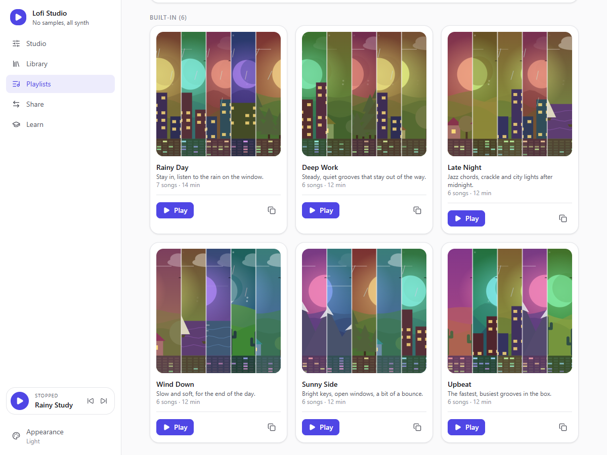
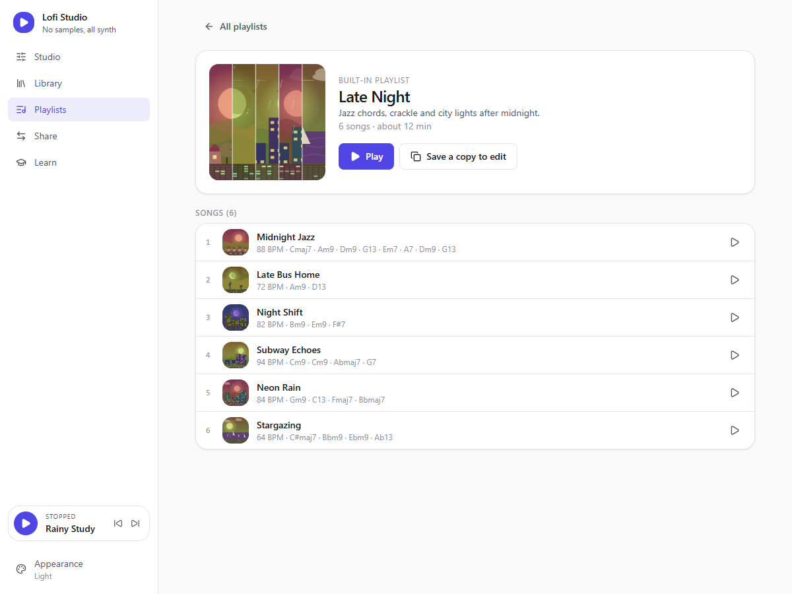
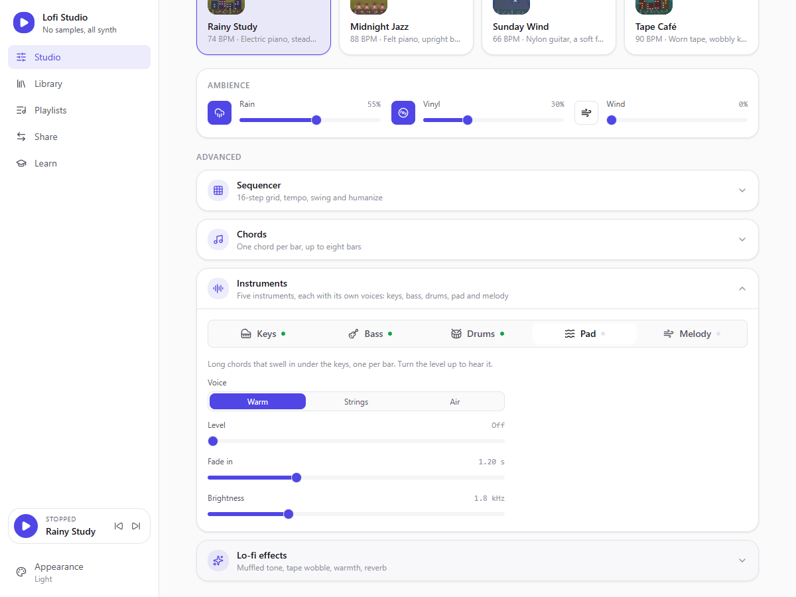
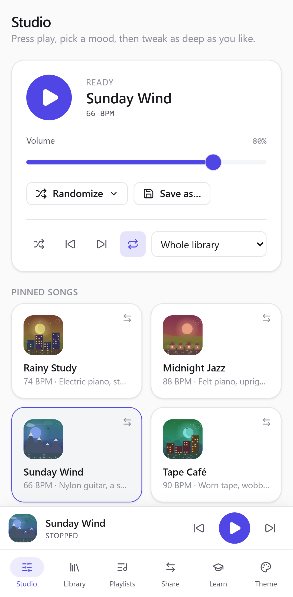

# Lofi Studio

A modular Lo-Fi mini-studio for the desktop and Android. **Every sound is synthesized live** (jazzy keys, bass, drums, pads, melodies, rain, vinyl crackle, wind) with Tone.js and the Web Audio API. No samples, no audio files.

Tauri 2 (Rust) · React 19 · TypeScript · Zustand · Tone.js · Tailwind 3 + Radix.


## Features

- **One-click moods.** 24 built-in songs (62–96 BPM), each with its own band, groove, chords and weather; a test makes sure no two sound alike. Four of them are pinned on the Studio page. Choose which four.
- **Five instruments, each with its own voices.** Keys (electric piano, felt piano, organ, nylon guitar, vibraphone), bass (sub, upright, synth), drums (boom bap, brushes, deep 808), a pad that swells under the chords (warm, strings, air) and a melody on its own sequencer row (flute, music box, square) that always picks notes from the current chord.
- **Procedural sound.** Keys through a low-pass + LFO wobble and chorus, a filter-enveloped bass, synthesized drums, and three ambience layers: rain (filtered pink noise + droplets), vinyl (random crackle and hiss), wind (slowly drifting brown noise).
- **Two levels of control.** Minimal by default; expandable panels for the 16-step sequencer (tempo, swing, humanize), a **chord editor** (one chord per bar, up to eight bars, ready-made progressions), instruments (one tab each: voice, level, waveform, ADSR envelope, filter, LFO, pad fade-in, melody echo) and lo-fi effects (tape wobble, warmth, reverb, master low-pass).
- **Randomize menu.** New groove, new chords, new sound or "Surprise me", each drawn from musically safe choices (curated jazzy progressions, soft ranges), never touching volume or levels. Up to five undos.
- **Library.** Save any sound as a song, rename it, pin it, delete it. Built-in songs can be copied.
- **Playlists.** Six built-in playlists (Rainy Day, Deep Work, Late Night...) plus your own: group any songs, reorder them, play them from the Playlists page or the Studio. Built-in playlists can be copied to edit.
- **Player.** Previous / next, shuffle, repeat (off, all, this song) and a source picker (whole library or one playlist). Songs loop until they last about two minutes, then the next one starts; auto-advance never replaces a sound with unsaved edits.
- **Generated covers.** Every song gets its own cover, drawn from its params, so songs that sound alike look alike. The sound picks a world (city, sea, mountains, forest, desert, fields) with one landmark per chord; the key sets the colors, a dark tone brings the night and a moon, the pad adds clouds, the melody birds, the ambience rain and wind, and the pattern shows as a strip at the bottom. A playlist cover is a strip of slices cut from its songs' covers. Nothing is stored: covers are recomputed.
- **Share.** Send songs *and playlists* as a `.lofi.json` file or as a short compressed code you can paste in a chat. Pick what to send from cover tiles; when receiving, drop a file or paste a code to see what is inside before adding it. Songs you already have are not duplicated.
- **Android.** A phone layout (bottom tab bar and player, touch-sized controls, back button support) and a GitHub Actions workflow that builds an installable APK.
- **Interactive tutorial.** Fourteen short lessons in four levels, from the first loop to sharing songs. Every lesson embeds the real controls plus a live diagram (signal path, swing, piano keys of the current chord, filter wobble), and progress is remembered.
- **59 themes** with live previews, searchable, light/dark, optional "match system".

| Library | Share |
| --- | --- |
|  |  |

| Playlists | Playlist |
| --- | --- |
|  |  |

| Instruments | On a phone |
| --- | --- |
|  |  |

| Appearance | Another theme |
| --- | --- |
|  |  |

| Chord editor | Tutorial |
| --- | --- |
|  |  |

## Using it

1. **Studio**: press play, click a pinned song, add rain or vinyl. Open *Advanced* to edit the groove, the chords and the instruments. Once you changed something, *Save* updates your song, *Save as…* stores a new one.
2. **Library**: all your songs and the built-in ones. The pin button assigns a song to one of the four Studio slots.
3. **Playlists**: create one here or with the playlist button on any song, add and reorder songs, then press *Play*. The Studio has previous / next, shuffle, repeat and the source picker.
4. **Share**: under *Send*, tick songs or playlists, then *Copy code* or *Save file…*. Under *Receive*, drop or open a file, or paste a code, untick what you do not want and add the rest. Nothing is ever overwritten.
5. **Learn**: start at level 1 if music is new to you; each lesson is hands-on.
6. **Appearance** (bottom of the sidebar, *Theme* on a phone): pick a theme.

## Run

```bash
npm install
npm run tauri dev      # desktop app
npm run dev            # browser only (config falls back to localStorage)
npm run tauri build    # release bundle
```

Requires Node 20+ and a Rust toolchain (plus WebView2 on Windows).

```bash
npm run typecheck && npm test      # front end
cd src-tauri && cargo test         # Rust
```

## Android

The APK is built by [`.github/workflows/android.yml`](.github/workflows/android.yml): push a `v*` tag and the APK is attached to that tag's draft release, or run the workflow by hand and download it from the run's artifacts.

To sign it with your own key (so each new APK installs over the previous one), create a keystore once and add three repository secrets:

```bash
keytool -genkeypair -keystore release.jks -alias lofi-studio -keyalg RSA -keysize 2048 -validity 10000
base64 -w0 release.jks   # -> ANDROID_KEYSTORE_BASE64
```

`ANDROID_KEYSTORE_PASSWORD` is the password you chose and `ANDROID_KEY_ALIAS` is `lofi-studio`. Without these secrets the workflow signs with a throwaway key: the APK installs, but updating means uninstalling first.

Locally (Android SDK, NDK and the Rust Android targets installed, `NDK_HOME` set):

```bash
npm run tauri android build -- --apk            # release, all ABIs
npm run tauri android build -- --apk --debug --target aarch64
```

## Project layout

| Path | Role |
| --- | --- |
| `src/audio/` | `AudioEngine` and its parts (instruments, ambience, procedural noise, music helpers). No React, no store: it receives an immutable `EngineParams` snapshot. |
| `src/songs/` | The song domain: types, defaults, built-in songs and playlists, play queue, cover art scenes, sanitizers for untrusted input, share format and import planning. Pure TypeScript, unit-tested. |
| `src/state/` | Zustand stores (studio, library, player, navigation), the queue / auto-advance logic (`playback.ts`), cross-store actions, persistence and audio wiring. |
| `src/learn/` | The tutorial curriculum (levels and lesson ids). The lesson bodies live in `src/components/learn/`. |
| `src/pages/`, `src/components/` | Pages (Studio, Library, Playlists, Share, Learn) and their components; `ui/` holds the shadcn-style primitives on Radix. |
| `src/themes/` | Design-token theme system: add a file in `definitions/` to add a theme. |
| `src-tauri/` | Rust shell: locked-down window and CSP, atomic config persistence, native file dialogs (also on Android). `gen/android` is the generated Android project, kept in git with its signing hook and edge-to-edge insets. |
| `.github/workflows/` | CI (typecheck, tests, build, `cargo test`) and the Android APK build. |

More detail for contributors is in [`CLAUDE.md`](CLAUDE.md).

## Notes

- The AudioContext is created on the first Play click (user gesture). Stopping fades out, halts the transport and noise sources, then suspends the context: an idle studio uses no CPU. Ambience layers only hold audio sources while audible.
- Your library and settings are saved (debounced) by the Rust side to `config.json` in the OS app-config directory; every field is re-validated on load and on import.
- File dialogs run in Rust: the web view never gets to name a path, and only the app's own pages can load in the window.
