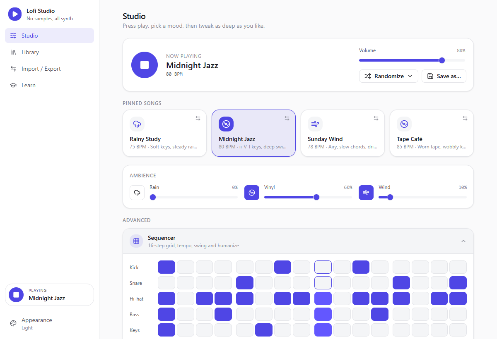
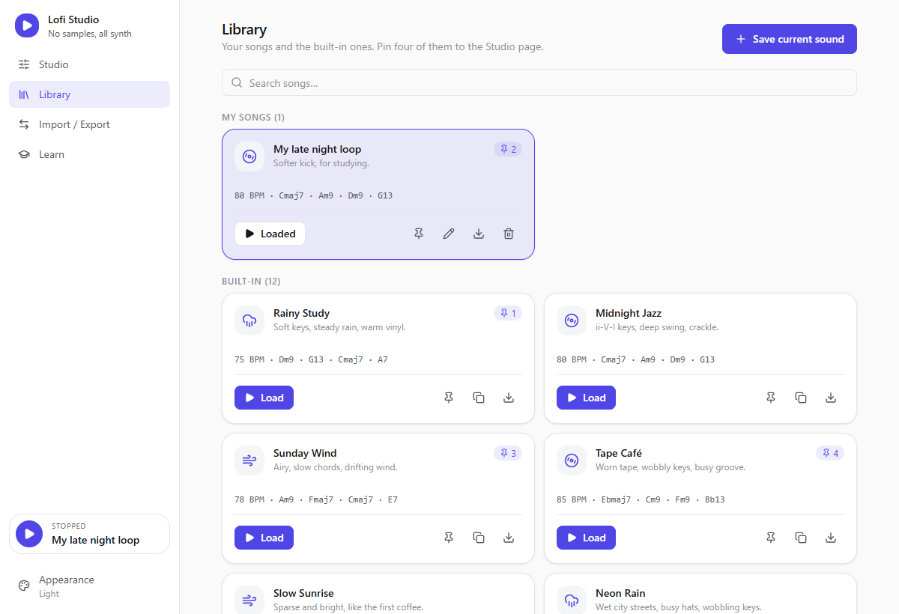
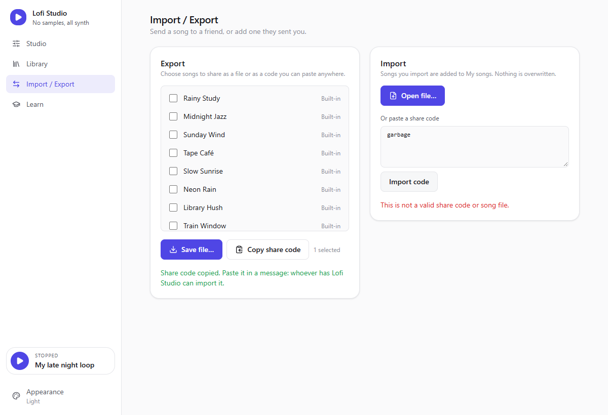
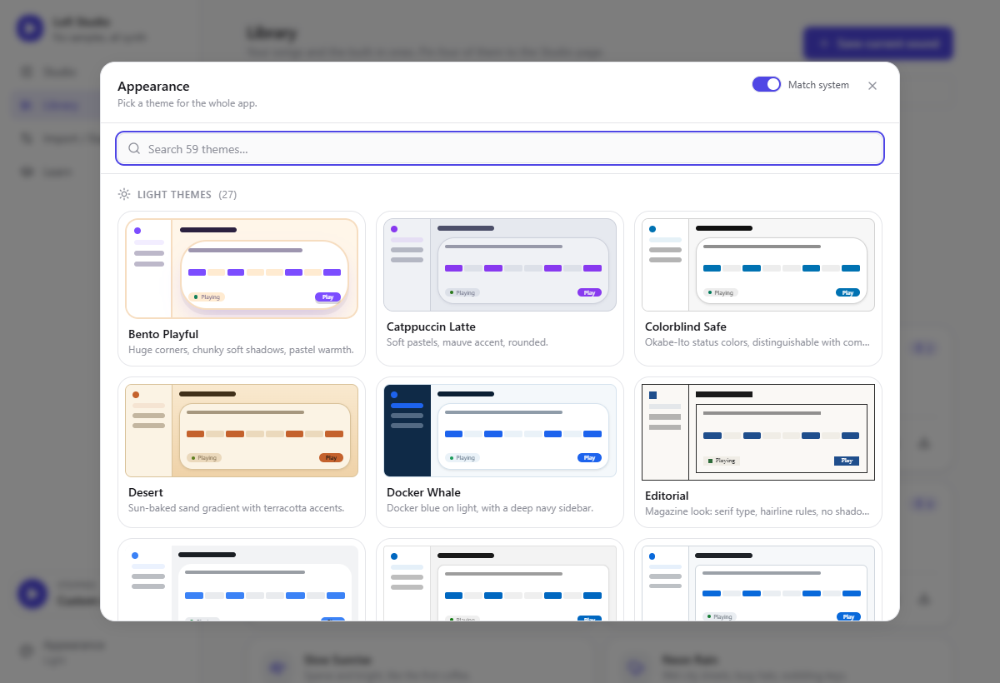
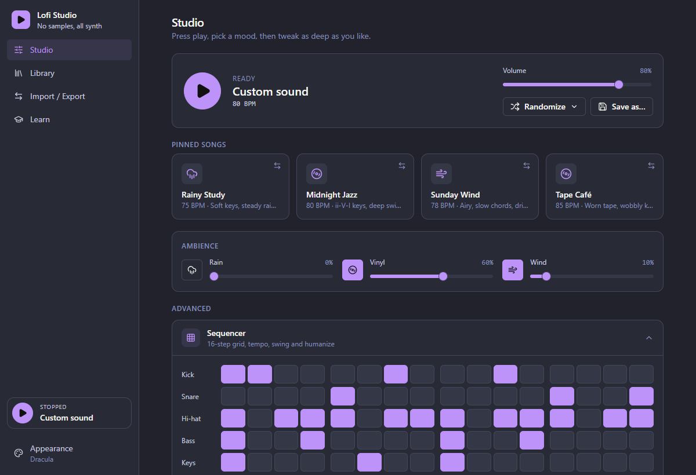
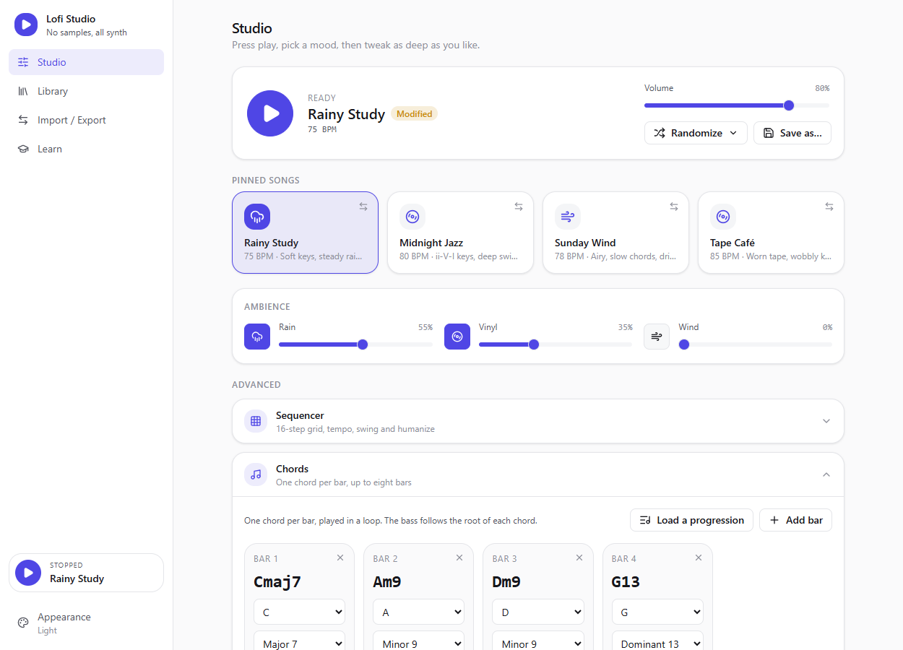
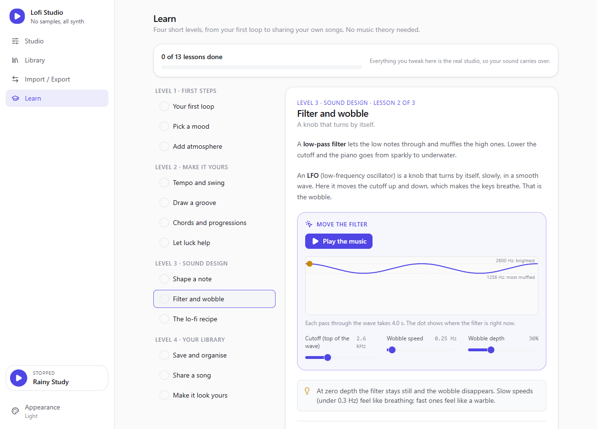

# Lofi Studio

A modular Lo-Fi mini-studio for the desktop. **Every sound is synthesized live** (jazzy keys, bass, drums, rain, vinyl crackle, wind) with Tone.js and the Web Audio API. No samples, no audio files.

Tauri 2 (Rust) · React 19 · TypeScript · Zustand · Tone.js · Tailwind 3 + Radix.



## Features

- **One-click moods.** Twelve built-in songs (70–85 BPM, jazzy chords, groove, sound, ambience), four of them pinned on the Studio page. Choose which four.
- **Procedural sound.** FM electric piano with low-pass + LFO wobble, sub bass, synthesized drums, and three ambience layers: rain (filtered pink noise + droplets), vinyl (random crackle and hiss), wind (slowly drifting brown noise).
- **Two levels of control.** Minimal by default; expandable panels for the 16-step sequencer (tempo, swing, humanize), a **chord editor** (one chord per bar, up to eight bars, ready-made progressions), instruments (waveforms, ADSR envelopes, filters, LFO) and lo-fi effects (tape wobble, warmth, reverb, master low-pass).
- **Randomize menu.** New groove, new chords, new sound or "Surprise me", each drawn from musically safe choices (curated jazzy progressions, soft ranges), never touching volume or levels. Up to five undos.
- **Library.** Save any sound as a song, rename it, pin it, delete it. Built-in songs can be copied.
- **Import / export.** Share songs as a `.lofi.json` file or as a short text code you can paste in a chat.
- **Interactive tutorial.** Thirteen short lessons in four levels, from the first loop to sharing songs. Every lesson embeds the real controls plus a live diagram (signal path, swing, piano keys of the current chord, filter wobble), and progress is remembered.
- **59 themes** with live previews, searchable, light/dark, optional "match system".

| Library | Import / Export |
| --- | --- |
|  |  |

| Appearance | Another theme |
| --- | --- |
|  |  |

| Chord editor | Tutorial |
| --- | --- |
|  |  |

## Using it

1. **Studio**: press play, click a pinned song, add rain or vinyl. Open *Advanced* to edit the groove, the chords and the instruments. Once you changed something, *Save* updates your song, *Save as…* stores a new one.
2. **Library**: all your songs and the built-in ones. The pin button assigns a song to one of the four Studio slots.
3. **Import / Export**: tick songs, then *Save file…* or *Copy share code*. To import, open a file or paste a code; imported songs are added to *My songs* and never overwrite anything.
4. **Learn**: start at level 1 if music is new to you; each lesson is hands-on.
5. **Appearance** (bottom of the sidebar): pick a theme.

## Run

```bash
npm install
npm run tauri dev      # desktop app
npm run dev            # browser only (config falls back to localStorage)
npm run tauri build    # release bundle
```

Requires Node 20+ and a Rust toolchain (plus WebView2 on Windows).

```bash
npm run typecheck && npm test      # front end
cd src-tauri && cargo test         # Rust
```

## Project layout

| Path | Role |
| --- | --- |
| `src/audio/` | `AudioEngine` and its parts (instruments, ambience, procedural noise, music helpers). No React, no store: it receives an immutable `EngineParams` snapshot. |
| `src/songs/` | The song domain: types, defaults, built-in songs, sanitizers for untrusted input, share format. Pure TypeScript, unit-tested. |
| `src/state/` | Zustand stores (studio, library, navigation), cross-store actions, persistence and audio wiring. |
| `src/learn/` | The tutorial curriculum (levels and lesson ids). The lesson bodies live in `src/components/learn/`. |
| `src/pages/`, `src/components/` | Pages (Studio, Library, Import/Export, Learn) and their components; `ui/` holds the shadcn-style primitives on Radix. |
| `src/themes/` | Design-token theme system: add a file in `definitions/` to add a theme. |
| `src-tauri/` | Rust shell: locked-down window and CSP, atomic config persistence, native file dialogs. |

More detail for contributors is in [`CLAUDE.md`](CLAUDE.md).

## Notes

- The AudioContext is created on the first Play click (user gesture). Stopping fades out, halts the transport and noise sources, then suspends the context: an idle studio uses no CPU. Ambience layers only hold audio sources while audible.
- Your library and settings are saved (debounced) by the Rust side to `config.json` in the OS app-config directory; every field is re-validated on load and on import.
- File dialogs run in Rust: the web view never gets to name a path, and only the app's own pages can load in the window.
